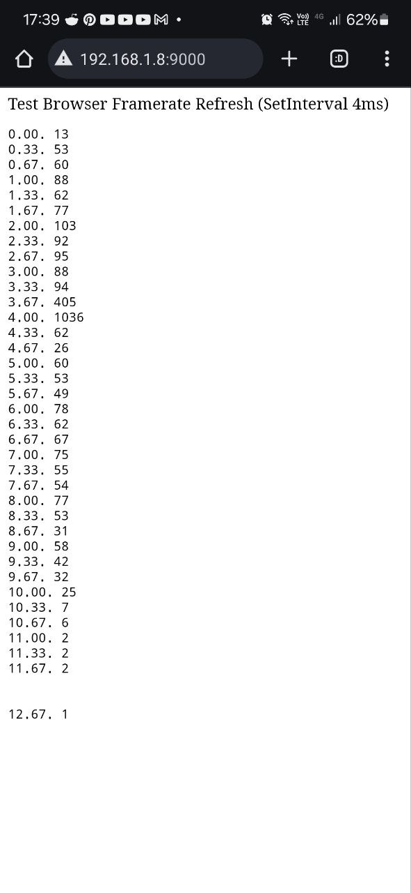
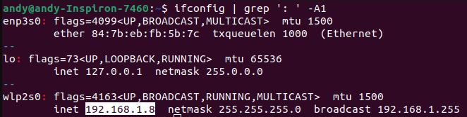

# [Test] Browser SetInterval
Checks PC / Android Browser performance of SetInterval (4ms)

## Prerequisites
1. Linux
1. Python 3

## How to run
1. Start python server on your PC with: python3 -m http.server 9000
1. Browse to: http://0.0.0.0:9000/
1. Run `ifconfig` and check your PC IP
   
1. On your smartphone connected to the same wifi network as your PC, browse to `http://TYPE_YOUR_PC_IP:9000/` (e.g. http://192.168.1.8:9000/)